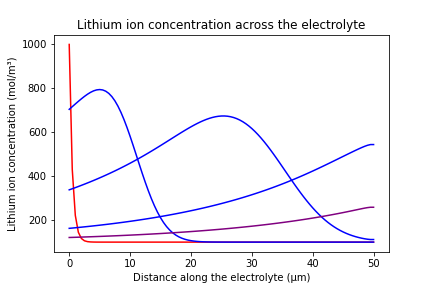

## Lithium-Ion Transport Modelling in Battery Electrolytes

This project models lithium-ion transport during battery discharge by solving a 1D convection–diffusion PDE using both explicit (FTCS) and implicit (Crank–Nicolson) finite difference methods.  
The results capture ion migration from anode to cathode and highlight key numerical trade-offs between stability, accuracy, and computational cost.

The full project description, derivations, and analysis are available in the report:  
[Full Project Report (PDF)](ME2%20Computing%20Coursework.pdf)

Credits: Enrico Vittori, Jaime Lopez Ruiz

---

## Visualisations

### Heatmap of ion concentration evolution

### Explicit vs Implicit method comparison

### Example concentration profile

